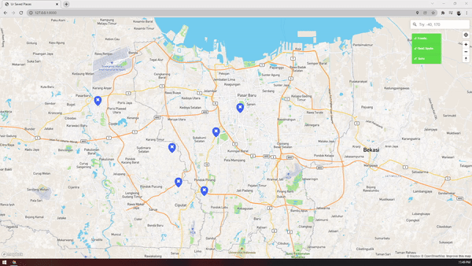

# FP SIG - Place Saving in Map
1. Fitur menyimpan lokasi sesuai dengan posisi pointer mouse pada map

2. Fitur grouping untuk setiap lokasi yang telah disimpan

3. Fitur mencari suatu lokasi

4. Fitur mendapatkan lokasi user dan mencari rute ke suatu lokasi

